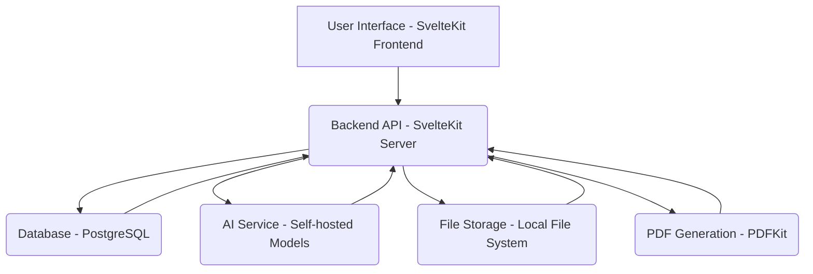

# Comprehensive Architectural Plan for Advanced POI and Case Management System

This plan outlines the architecture for the advanced features, focusing on a robust, scalable, and maintainable system.

## I. Core System Architecture Overview

## II. Feature-Specific Architectural Details

### 1. Advanced POI Management: Aliases and Detailed Prior/Conviction Tracking
*   **Database Schema (`src/lib/server/db/schema.ts`):**
    *   `criminals` table:
        *   `aliases`: `jsonb` type to store an array of strings (e.g., `['John Doe', 'JD']`).
        *   `priors`: `jsonb` type to store an array of objects, each containing `date`, `crime`, and `outcome` (e.g., `[{ date: '2020-01-15', crime: 'Theft', outcome: 'Guilty' }]`).
        *   `convictions`: `jsonb` type, similar structure to `priors`.
*   **Backend API (`src/routes/api/criminals/[id]/+server.ts`):**
    *   Endpoints for CRUD operations on criminal records, including handling updates to `aliases`, `priors`, and `convictions` fields.
    *   Validation logic for these new fields.
*   **Frontend (SvelteKit):**
    *   UI components for adding, editing, and displaying aliases, priors, and convictions on the POI detail page.
    *   Forms with dynamic fields for adding multiple entries for priors/convictions.

### 2. Evidence Management: Uploads, AI Summarization, Tagging, and Drag-and-Drop Association
*   **Database Schema (`src/lib/server/db/schema.ts`):**
    *   `evidence` table:
        *   `caseId`: Foreign key to `cases.id`.
        *   `poiId`: Optional foreign key to `criminals.id` for direct POI association.
        *   `fileName`, `fileType`, `fileSize`, `uploadDate`.
        *   `filePath`: `text` for the path to the file on the local file system.
        *   `summary`: `text` for AI-generated summary.
        *   `tags`: `jsonb` for AI-generated or manual tags.
        *   `originalContent`: `text` for extracted text content from documents (for AI processing).
*   **File Storage:**
    *   **Hybrid Approach:** File metadata (name, type, size, local path) will be stored in the PostgreSQL database. The actual files will be stored on the local file system in a designated directory (e.g., `static/uploads/evidence/`).
    *   **Upload Process:**
        *   Frontend sends file to backend.
        *   Backend saves file to `static/uploads/evidence/` with a unique filename (e.g., UUID).
        *   Backend extracts text content (for documents) and stores it in `originalContent`.
        *   Backend calls AI service for summarization and tagging.
        *   Backend stores file metadata, summary, and tags in the `evidence` table.
*   **Backend API (`src/routes/api/evidence/+server.ts`):**
    *   Endpoints for file upload, retrieval, and deletion.
    *   Integration with AI service for summarization and tagging.
    *   Handling of drag-and-drop uploads.
*   **Frontend (SvelteKit):**
    *   Drag-and-drop upload interface.
    *   Display of uploaded evidence with summaries and tags.
    *   UI for associating evidence with cases and POIs.

### 3. AI-driven Features: Auto-completion, Semantic Vector Embeddings, AI-detected Public Threat Levels
*   **AI Service Provider:** Self-hosted open-source models (e.g., Hugging Face models, Llama 2).
*   **Implementation Strategy:**
    *   **Model Hosting:** Utilize a framework like `ollama` or `transformers.js` (if feasible for client-side, otherwise server-side Python/Node.js with a model serving library) to host and serve the chosen open-source models locally or on a dedicated server.
    *   **Semantic Vector Embeddings:**
        *   **Database Schema (`src/lib/server/db/schema.ts`):**
            *   `contentEmbeddings` table:
                *   `contentId`: ID of the associated content (evidence, law_paragraph).
                *   `contentType`: 'evidence' or 'law_paragraph'.
                *   `embedding`: `vector` type (using `pgvector` extension) to store the numerical vector.
        *   **Process:** When new evidence or law paragraphs are added/updated, their `originalContent` or `paragraphText` will be sent to the self-hosted embedding model. The generated vector will be stored in `contentEmbeddings`.
    *   **Auto-completion for Case Fields:**
        *   Frontend sends partial input to backend.
        *   Backend queries relevant data (e.g., existing case titles, criminal names) and uses a lightweight language model (self-hosted) for intelligent suggestions.
    *   **AI Summarization:**
        *   Backend sends `originalContent` of evidence to a self-hosted summarization model.
        *   The generated summary is stored in `evidence.summary`.
    *   **AI-detected Public Threat Levels:**
        *   Backend analyzes criminal data (priors, convictions, notes, etc.) using a self-hosted classification model.
        *   The model outputs a threat level (e.g., 'Low', 'Medium', 'High', 'Extreme'), which is stored in `criminals.threatLevel`. This could be a periodic batch process or triggered on data updates.

### 4. Case Analytics: Case Summarization and "Danger Score" Calculation
*   **Database Schema (`src/lib/server/db/schema.ts`):**
    *   `cases` table:
        *   `dangerScore`: `integer` (0-100).
        *   `aiSummary`: `text` for AI-generated case summary.
*   **Backend Logic:**
    *   **Case Summarization:** Leverage the self-hosted AI summarization model to generate a comprehensive summary of a case based on its description, linked evidence summaries, and notes. This can be triggered on case updates.
    *   **Danger Score Calculation:**
        *   Define a scoring algorithm based on factors like:
            *   Linked criminals' `threatLevel`.
            *   Severity of `linkedCrimes`.
            *   Number and nature of `priors` and `convictions` of linked criminals.
            *   Specific keywords in `notes` or `description`.
        *   This calculation can be a backend function triggered on case or linked criminal/crime updates.

### 5. Reporting: PDF Export of Case Reports and Law Content
*   **PDF Generation Library:** `pdfkit` (server-side Node.js library).
*   **Backend API:**
    *   Endpoints (e.g., `/api/reports/case/[id]/pdf`, `/api/reports/statute/[id]/pdf`) that:
        *   Fetch relevant data from the database (case details, evidence, law paragraphs).
        *   Use `pdfkit` to generate a PDF document.
        *   Stream the generated PDF back to the frontend for download.
    *   PDF content will include formatted text, tables (for priors/convictions), and potentially embedded images (for criminal photos or evidence previews).

### 6. Laws Page Enhancements: Markdown Rendering, Anchor Linking, "Link to Case" Functionality, Linked Cases Sidebar, and Mapping Law Paragraphs to Crimes with Auto-suggestions
*   **Database Schema (`src/lib/server/db/schema.ts`):**
    *   `lawParagraphs` table:
        *   `statuteId`: Foreign key to `statutes.id`.
        *   `paragraphText`: `text` for the law content (can be Markdown).
        *   `anchorId`: `text` for unique anchor links within a statute.
        *   `linkedCaseIds`: `jsonb` to store an array of case IDs linked to this paragraph.
        *   `crimeSuggestions`: `jsonb` for AI-suggested crimes related to the paragraph.
*   **Frontend (SvelteKit):**
    *   **Markdown Rendering:** Use a client-side Markdown renderer (e.g., `marked.js` or a Svelte Markdown component) to display `paragraphText`.
    *   **Anchor Linking:** Implement client-side routing and scrolling to specific `anchorId`s within the law page.
    *   **"Link to Case" Functionality:** UI to allow users to associate a specific law paragraph with one or more cases.
    *   **Linked Cases Sidebar:** A dynamic sidebar on the law page displaying a list of cases linked to the currently viewed law paragraph.
*   **Backend API:**
    *   Endpoints for managing `lawParagraphs`, including linking cases and retrieving linked cases.
    *   Integration with AI service for `crimeSuggestions` based on `paragraphText` (semantic similarity using embeddings).

## III. General Architectural Considerations

*   **Authentication & Authorization:** Leverage existing `userTable`, `sessionTable`, and `keyTable` for authentication. Implement robust authorization checks on all API endpoints to ensure users only access data they are permitted to see.
*   **Error Handling:** Implement centralized error handling on both frontend and backend to provide meaningful error messages and log issues.
*   **Logging & Monitoring:** Set up logging for application events, errors, and performance metrics.
*   **Scalability:** Design APIs to be stateless where possible. Consider caching strategies for frequently accessed data.
*   **Security:** Implement best practices for data security, including input validation, parameterized queries, and protection against common web vulnerabilities (XSS, CSRF).
*   **Testing:** Implement unit, integration, and end-to-end tests for all new features.
*   **Deployment:** Consider Docker for containerization to ensure consistent environments for development and production, especially for self-hosted AI models.

## IV. Next Steps

Once this architectural plan is approved, the next phase will involve:
1.  Detailed design of API endpoints and data models.
2.  Setting up the self-hosted AI environment.
3.  Implementing the database schema changes.
4.  Developing backend services and frontend components.