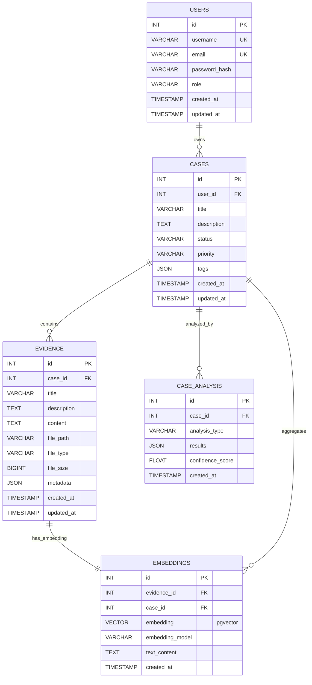

# Revised Plan: Deeds Application with Vector Search and AI Capabilities

**Goal:** To build a case management application with user authentication, case management, evidence management with semantic search using SvelteKit, PostgreSQL with pgvector, Drizzle ORM, Qdrant vector database, and Tauri.

**I. Architecture Overview**

*   **Frontend (SvelteKit):** Handles UI, user interaction, and client-side logic for both web and desktop apps.
*   **Web Backend (SvelteKit API Routes):** Node.js/TypeScript API routes for web app, connects to shared database.
*   **Desktop Backend (Rust + Tauri):** Native Rust backend for desktop app performance and security.
*   **Database (PostgreSQL + pgvector):** Shared database stores user data, case data, evidence data, and vector embeddings using Drizzle ORM.
*   **Vector Database (Qdrant):** Shared high-performance vector search and similarity matching for evidence and case analysis.
*   **AI/NLP Services:** Python microservices for text processing, embedding generation, and semantic analysis.

**II. Core Functionality**

1.  **User Authentication:**
    *   **Registration:** `/register` (Frontend & Backend API)
    *   **Login:** `/login` (Frontend & Backend API)
    *   **Logout:** `/logout` (Frontend & Backend API)
    *   **Profile:** `/profile` (Frontend & Backend API)
2.  **Case Management:**
    *   **List Cases:** `/cases` (Frontend & Backend API - GET `/api/cases`)
    *   **Create Case:** `/cases/new` (Frontend & Backend API - POST `/api/cases`)
    *   **View Case Details:** `/cases/[id]` (Frontend & Backend API - GET `/api/cases/[id]`)
    *   **Edit Case:** `/cases/[id]/edit` (Frontend & Backend API - PUT `/api/cases/[id]`)
    *   **Delete Case:** (Backend API - DELETE `/api/cases/[id]`)
3.  **Evidence Management:**
    *   **Upload Evidence:** `/api/evidence/upload` (Backend API - POST)
    *   **View Evidence:** Display evidence on `/cases/[id]` (Frontend)
    *   **Associate Evidence with Cases:** (Backend - handled during case creation/update)
4.  **Timeline (Conceptual):**
    *   `/cases/[id]/timeline` (Frontend)
    *   `/api/timeline` (Backend API - CRUD operations)
5.  **Homepage:**
    *   `/` (Frontend) - Displays a summary of the user's cases.

**III. Technology Stack**

*   **Frontend:** SvelteKit, Svelte components, HTML, Vanilla CSS, JavaScript
*   **Web Backend:** SvelteKit API routes, Node.js, TypeScript
*   **Desktop Backend:** Rust + Tauri for native performance and security
*   **Database:** PostgreSQL with pgvector extension, Drizzle ORM
*   **Vector Database:** Qdrant for high-performance vector operations
*   **AI/ML:** Python microservices (FastAPI), sentence-transformers, spaCy
*   **Authentication:** Lucia v3 (web), Tauri secure storage (desktop)
*   **File Storage:** Local filesystem with organized directory structure
*   **Deployment:** Docker Compose for services, standalone executables for desktop

**IV. Detailed Implementation Steps**

1.  **Authentication:**
    *   Integrate `Lucia v3` for session management.
    *   Implement `bcrypt` (or a similar library) for password hashing.
    *   Use PostgreSQL for session storage via Drizzle ORM.
    *   Implement Tauri secure storage for desktop credentials.
2.  **API Endpoints:**
    *   Implement CRUD operations for cases (`/api/cases`).
    *   Implement CRUD operations for evidence (`/api/evidence`).
    *   Implement vector search endpoints (`/api/search`).
    *   All endpoints use PostgreSQL + pgvector via Drizzle ORM.
3.  **Frontend Components:**
    *   Create reusable components: `CaseCard`, `EvidenceUpload`.
    *   Implement the `CaseList`, `CaseDetail`, `NewCaseForm`, and `EditCaseForm` pages.
    *   Connect components to API endpoints.
    *   Style with vanilla CSS for maximum compatibility.
4.  **Vector Search Integration:**
    *   Set up Qdrant for high-performance similarity search.
    *   Store embeddings in both PostgreSQL (pgvector) and Qdrant.
    *   Implement semantic search across cases and evidence.
5.  **Database Setup:**
    *   Configure PostgreSQL with pgvector extension.
    *   Set up Drizzle ORM with proper schema definitions.
    *   Implement migrations for cases, users, evidence, and embeddings tables.
6.  **Tauri Integration:**
    *   Use Tauri's secure storage for tokens/credentials.
    *   Implement Rust backend commands for database operations.
    *   Connect Tauri backend to shared PostgreSQL/Qdrant instances.
7.  **Testing:** Thoroughly test all features, including authentication, CRUD operations, and vector search functionality.

**V. Database Schema (PostgreSQL with pgvector + Drizzle ORM)**

**Key Features:**
- **pgvector Extension:** Enables native vector storage and similarity search in PostgreSQL
- **Drizzle ORM:** Type-safe database operations for both web and desktop apps
- **Vector Embeddings:** Stored in PostgreSQL for persistence, mirrored in Qdrant for performance
- **Flexible Schema:** JSON fields for metadata and tags allow schema evolution
- **Audit Trail:** Created/updated timestamps on all entities